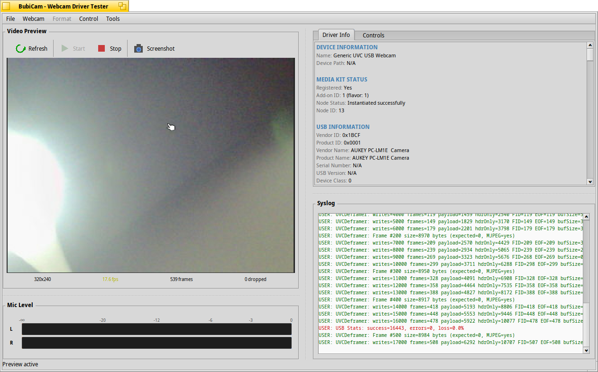

# BubiCam

Webcam tester for Haiku OS. Useful for testing and debugging USB webcam drivers.



## Features

- Live video preview with FPS stats
- Driver and USB device info display
- UVC descriptor parsing
- Syslog monitor (filtered for USB/webcam messages)
- Audio VU meter for built-in microphones
- Webcam controls (brightness, contrast, etc.)
- Screenshot capture (PNG)
- Export driver info (text/JSON)

## Build

```bash
make
```

## Install

```bash
make install
```

Or copy `objects.x86_64-cc13-release/BubiCam` to `~/config/apps/`.

## Usage

1. Select a webcam from the **Webcam** menu
2. Click **Start** to begin preview
3. Check **Driver Info** tab for device details
4. Use **Controls** tab to adjust settings

### Shortcuts

| Key | Action |
|-----|--------|
| Cmd+R | Refresh devices |
| Cmd+S | Start preview |
| Cmd+T | Stop preview |
| Cmd+P | Screenshot |
| Cmd+E | Export info |
| Cmd+L | Clear syslog |
| Cmd+Shift+M | Restart media services |

## Troubleshooting

**No webcams found**: Check `listusb` output and syslog for driver messages.

**"Name not found" error**: Use Tools > Restart Media Services.

**Preview not working**: Check syslog for errors. Try restarting media services.

## License

MIT
