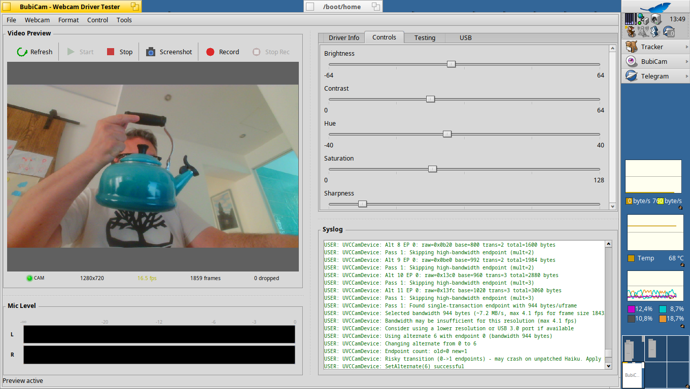

# BubiCam

Webcam tester for Haiku OS. Useful for testing and debugging USB webcam drivers.



## Features

### Video
- Live video preview with FPS, frame count, and drop stats
- MJPEG decompression via libjpeg-turbo
- YUV422, YUV420, NV12, NV21, UYVY format conversions (SSE2-optimized)
- Zoom (1x-8x) with mouse wheel, pan with click-drag
- RGB histogram overlay (Cmd+H)
- A/B format comparison (capture reference, split-view side-by-side)
- Grid overlay (rule of thirds, center crosshair)
- Fullscreen mode (Enter)
- Floating always-on-top preview window

### Recording
- Video recording to AVI (Motion JPEG) with audio
- Time-lapse capture with configurable interval
- Circular buffer for retroactive "save last N seconds"
- Screenshot capture (PNG)

### Audio
- Audio VU meter for built-in microphones
- Audio source selection (webcam mic, system input, or none)
- Audio recording integrated into AVI output

### Driver Testing
- Stress test (repeated start/stop cycles)
- Latency test (capture-to-display timing)
- Format benchmark (compare performance across formats)
- Memory leak test
- Cycle test (connect/disconnect hot-plug robustness)
- Export test results as CSV or JSON with timestamps
- Diagnostic report generation for bug reports

### Device Info
- Driver and USB device info display
- UVC descriptor parsing
- Syslog monitor (filtered for USB/webcam messages)
- USB packet inspection
- Webcam controls (brightness, contrast, etc.)
- Export driver info (text/JSON)
- Raw frame export for driver debugging

### Integration
- MCP server (port 9847) for Claude Code integration
- Deskbar replicant with status LED
- Desktop replicant with live preview
- MJPEG HTTP streaming server for browser viewing
- Virtual webcam (BMediaAddOn) as source for other apps
- System notifications for events
- `hey` scripting support
- Localization (EN, IT, DE, ZH, JA)
- Headless command-line mode (`bubicam --headless`)
- System theme support (adapts to dark/light themes)

### Library
- `libwebcam.so` reusable shared library with public API in `lib/libwebcam/include/`

## Build

```bash
make
```

## Install

```bash
make install
```

Or copy `objects.x86_64-cc13-release/BubiCam` to `~/config/apps/`.

## Usage

1. Select a webcam from the **Webcam** menu
2. Click **Start** to begin preview
3. Check **Driver Info** tab for device details
4. Use **Controls** tab to adjust settings

### Shortcuts

| Key | Action |
|-----|--------|
| Cmd+R | Refresh devices |
| Cmd+S | Start preview |
| Cmd+T | Stop preview |
| Cmd+P | Screenshot |
| Cmd+E | Export info |
| Cmd+H | Toggle histogram |
| Cmd+G | Toggle grid overlay |
| Cmd+B | Capture reference frame |
| Cmd+Shift+B | A/B compare mode |
| Cmd+0 | Reset zoom |
| Cmd+L | Clear syslog |
| Cmd+Shift+M | Restart media services |
| Enter | Fullscreen video |
| Escape | Exit fullscreen |

## Troubleshooting

**No webcams found**: Check `listusb` output and syslog for driver messages.

**"Name not found" error**: Use Tools > Restart Media Services.

**Preview not working**: Check syslog for errors. Try restarting media services.

**No video frames (bandwidth issue)**: The UVC driver may have selected insufficient USB bandwidth. BubiCam will detect this after 4 seconds and offer to switch to a lower resolution. Check syslog for `WaitFrame TIMEOUT` messages.

**Kernel panic on stop/start**: Haiku's USB stack can panic with "USB object did not become idle!" when isochronous pipes are torn down too quickly. BubiCam includes a 1-second settle delay to mitigate this, but the root cause is a kernel bug.

**App appears frozen / unkillable**: BubiCam has three levels of safety nets. If the UI stops responding, wait up to 15 seconds -- the emergency exit watchdog will force-terminate the process. If you don't want to wait, `kill -9` works once the watchdog has done its job.

## Documentation

- [Developer Guide](docs/DEVELOPER.md) -- architecture, internals, build details
- [Roadmap](docs/ROADMAP_v2.md) -- planned features and direction
- [Comparison](docs/COMPARISON.md) -- BubiCam vs Cortex vs CodyCam
- [libwebcam API](docs/libwebcam/README.md) -- reusable capture library

## License

MIT
